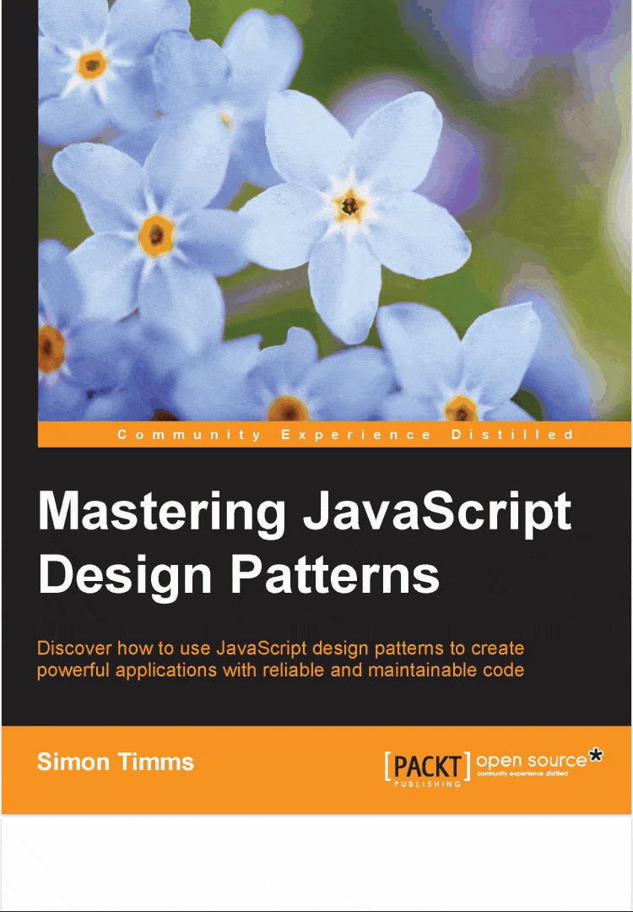

# pdf-vue3

[English](./README.md) ｜ [中文](./README_ZH.md)

vue3 pdf 查看器

在线演示: <https://hymhub.github.io/pdf-vue3/>



## 安装

```bash
  npm i pdf-vue3
```

## 使用

```vue
<script setup>
import PDF from "pdf-vue3";
</script>

<template>
  <PDF src="/demo.pdf" />
  <!-- <PDF :src="BASE64" /> -->
  <!-- <PDF :src="Uint8Array" /> -->
</template>
```

## 配置 API

### `组件参数(Props)`

|      属性     | 描述 |                 类型                 |
| :----------------: | :---------- | :----------------------------------: |
|       `src`        | PDF的URL或二进制数据（Uint8Array）或BASE64编码。 | `string` \| `Uint8Array` \| `BASE64` |
|   `showProgress`   | 是否显示下载进度条。默认值是`true`。 |              `boolean`               |
|  `progressColor`   | 下载进度条的颜色。默认值是`#87ceeb`。 |               `string`               |
| `showPageTooltip`  | 是否显示分页提示。默认值是`true`。 |              `boolean`               |
| `showBackToTopBtn` | 是否显示回顶部按钮。默认值是`true`。 |              `boolean`               |
| `scrollThreshold`  | 滚动距离超过多少显示返回顶部的按钮。默认值是`300`。 |               `number`               |
|     `pdfWidth`     | pdf页面宽度。默认值是 `100%`。 |               `string`               |
|      `rowGap`      | pdf页面之间的行距。默认值是`8`。 |               `number`               |
|       `page`       | 控制当前所在页码，支持响应式变量动态改变页码。默认值是 `1` | `number` |
|   `httpHeaders`    | 设置 httpHeaders 信息 |               `object`               |
| `withCredentials`  | 表示是否应该使用 cookies 或授权头等凭证进行跨站访问控制请求。默认为 `false`。 |              `boolean`               |
|     `password`     | 用于解密受密码保护的PDF。 |               `string`               |
|  `useSystemFonts`  | 当`true`时，没有嵌入到PDF文档中的字体将退回到系统字体。默认值在 web 环境中是`true`，在Node.js中是`false` 除非 `disableFontFace === true`，在这种情况下，无论环境如何，都默认为`false`（以防止字体完全损坏）。 |              `boolean`               |
|   `stopAtErrors`   | 当相关的PDF数据不能被成功解析时，拒绝某些承诺，例如`getOperatorList`、`getTextContent`和`RenderTask`，而不是尝试恢复任何可能的数据。默认值是`false`。 |              `boolean`               |
| `disableFontFace`  | 默认情况下，字体被转换为OpenType字体并通过字体加载API或`@font-face`规则加载。如果禁用，字体将使用内置的字体渲染器进行渲染，该渲染器使用原始路径命令构建字形。在网络环境中的默认值是`false`，在Node.js中是`true`。 |              `boolean`               |
|   `disableRange`   | 禁用PDF文件的范围请求加载。启用后，如果服务器支持部分内容请求，那么PDF将被分块取走。默认值是`false`。 |              `boolean`               |
|  `disableStream`   | 禁用PDF文件的数据流。默认情况下，PDF.js会尝试以块状方式加载PDF文件。默认值是`false`。 |              `boolean`               |
| `disableAutoFetch` | 禁用预取PDF文件的数据。当范围请求被启用时，PDF.js将自动继续获取更多的数据，即使不需要显示当前页面。默认值是`false`。注意：还必须禁用流媒体`disableStream`，见上文，以使禁用预取的功能正常工作。 |              `boolean`               |

### `事件(Events)`

|     Event Name      | Description |                 Parameters                 |
| :----------------: | :---------- | :----------------------------------: |
|       `onProgress`        | 监听 PDF 下载进度，参数为`0-100`。 | `loadRatio: number` |
|       `onComplete`        | 听 PDF 下载完成。 | `-` |
|       `onScroll`        | 监听 PDF 的滚动，参数是当前的`scrollTop`值。 | `scrollOffset: number` |
|       `onPageChange`        | 监听页码改变。 | `page: number` |

### `插槽(Slots)`

|     Slot Name      | Description |                 Parameters                 |
| :----------------: | :---------- | :----------------------------------: |
|       `progress`        | 定制进度条 | `loadRatio: number` |
|       `pageTooltip`        | 定制分页提示 | `currentPage: number, totalPages: number` |
|       `backToTopBtn`        | 定制回顶部按钮 | `scrollOffset: number` |
